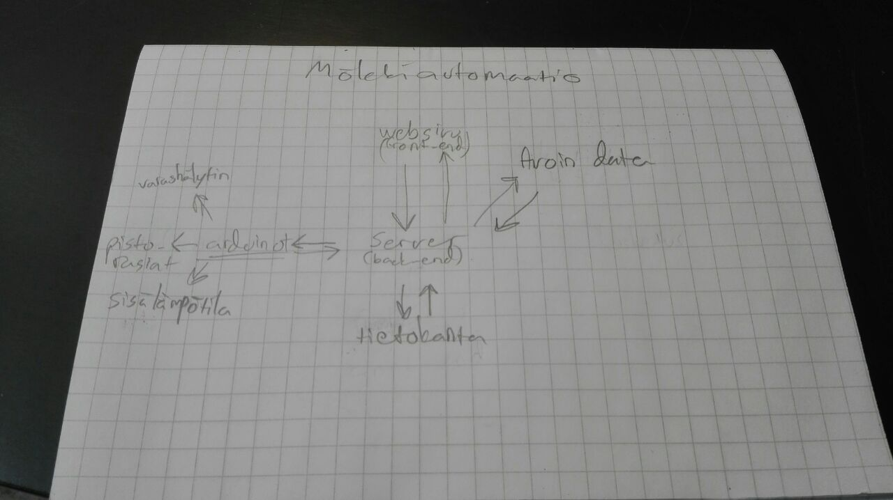

Home automation system
======================
------

## 1. Introduction

* Automation system for the cottage
* No former Internet connection
* Initial idea was to develop a cost-effective method for controlling the present heating system

## 2. Concept
### Server
* Manages all of the communication in the system

### User interface
* Operates as an user interface

### Control devices
* Control and measure the situation of the system

### Open data
* Collect additional information, such as weather forecasts

## 3. Server (Back-End) 
### 3.1 UI Services
* Authentication
* Transform obtained temperature and weather data into a comprehensive form
* Inventory management (gas, food, etc.)

### 3.2 Control device services
* Control devices: Receive situation update in 15 minutes intervals and send back the control parameters.
* (Optional: Automate temperature management)

### 3.3 Open data 
* Fetch history weather data and store it into the database
* Fetch forecast weather data and store it into the database

### 3.2 Tech
* Node.js

## 4. User interface (Front-End)
### 4.1. Services
* Server: Deliver user input
* Visualize 
* Inventory follow-up
* Temperature level settings
* Weather info

### 4.2 Tech
* React

## 5. Control devices
`ESP8266 serves as the communicator in the control devices end. Each 
actions are initialized by it.`

### 5.1. Services
* Server: POST-messages in every 15 minutes and receive control parameters
* Sensors: Adjust according to control parameters
* 3G modem: Use for WiFi connection

### 5.2. Components
* Microchip controller: NodeMCU microchip (ESP8266)
* WiFi electric plugs w/ remote controller (more safe to manage low voltages)
* 3G hotspot (Android)
* Humidity & Temperature: DHT22 sensor
* Cameras?
* 5V Relays
* LEDs

## 6. Open data
### 6.1. Services
* Use as a data resources

### 6.2 Finnish Meteorological Institute
* Get the information about the weather circumstances
* If the system hasa advanced enough, use data to adjust control parameters 

### 6.3 Lake temperatures in Finland
* Just for better user exprience gather information about the water temperatures
